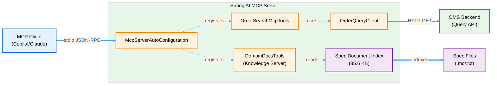

# Spring AI MCP Server Library

A **Model Context Protocol (MCP)** server built with Spring Boot and Spring AI, exposing OMS (Order Management System) query capabilities as MCP tools for AI assistants and clients.

---

## Table of Contents

1. [What is Spec-Driven Development?](#-what-is-spec-driven-development)
2. [Overview](#overview)
3. [Why Model Context Protocol (MCP)?](#why-model-context-protocol-mcp)
4. [Architecture](#architecture)
5. [Prerequisites](#prerequisites)
6. [Getting Started](#getting-started)
7. [Quick Start](#quick-start)
8. [Configuration](#configuration)
9. [Available Tools](#available-tools)
10. [Domain Knowledge Server](#domain-knowledge-server)
11. [Client Integration](#client-integration)
12. [Development](#development)
13. [Logging & Debugging](#logging--debugging)
14. [Troubleshooting](#troubleshooting)
15. [Documentation](#documentation)

---

## 🎯 What is Spec-Driven Development?

**Spec-Driven Development** is a methodology where your domain specifications become the single source of truth for development. Instead of specifications sitting in separate documents that developers rarely check, they become **active participants** in the coding process.

### How It Works with GitHub Copilot

With this MCP server, GitHub Copilot can:

1. **Read your specifications** directly from within your IDE
2. **Generate code** that follows your spec requirements
3. **Validate implementations** against specifications
4. **Answer questions** about your domain model using your own docs

### Example Workflow

```
Developer: "@workspace Using the OMS spec, create the Order entity class"

Copilot: [Reads specs/oms_spec.md and specs/domain-model_spec.md]
         [Generates Order.java with proper JPA annotations]
         [Includes Javadoc referencing specific spec sections]
         [Follows your exact naming conventions and patterns]
```

**Result:** Code that perfectly matches your specifications, with traceable references back to requirements.

### Why This Matters

- ✅ **Consistency** - All developers follow the same patterns
- ✅ **Onboarding** - New developers can query specs via Copilot
- ✅ **Quality** - Code reviews validate against specs automatically
- ✅ **Maintenance** - Specs stay synchronized with implementation
- ✅ **Documentation** - Living docs that actually get used

**👉 See the [Quick Start Guide](docs/QUICK_START_GUIDE.md) to try it in 5 minutes!**

---

## Overview

This project is a **knowledge-powered MCP server** that bridges your OMS specifications with AI-assisted development.

### Core Capabilities

**1. Domain Knowledge Server**
- Indexes 9 OMS specification documents (85+ KB of domain knowledge)
- Exposes 6 specialized MCP tools for reading, searching, and navigating specs
- Enables **spec-driven development** with GitHub Copilot and Claude
- Provides section-level navigation for large documents

**2. OMS Query Integration**
- Search OMS orders via `searchOrders` tool
- Typed filters with pagination and sorting
- Handles multiple response formats (Spring Data REST, HAL, plain JSON)

**3. Zero-Boilerplate Architecture**
- Spring AI `@Tool` annotations for automatic tool registration
- Runs over stdio for seamless MCP client integration
- Dual-mode: MCP server (stdio) or optional REST API

### The Knowledge Server Difference

**Traditional Approach:**
```
Developer → Searches for spec document
         → Opens in browser/editor
         → Reads and interprets
         → Writes code (hoping it matches)
         → Waits for code review to catch spec violations
```

**With MCP Knowledge Server:**
```
Developer → Asks Copilot: "@workspace Read the Order spec"
         → Copilot reads specs automatically
         → Generates spec-compliant code with references
         → Code review validates against cited specs
         → Specs become living documentation
```

**Key Features:**
- Zero-boilerplate tool registration using Spring AI `@Tool` annotations
- **Domain knowledge server** making OMS specs accessible to AI assistants
- **Section-level navigation** for precise spec access (e.g., "Read Domain Model section")
- Lombok-based logging with detailed request/response tracing
- OpenAPI-generated models for type-safe filter definitions
- Dual-mode operation: MCP server (stdio) and optional REST API demo endpoint

---

## Why Model Context Protocol (MCP)?

MCP is an open protocol that lets AI assistants (like GitHub Copilot and Claude) access external tools and data sources.

### The Problem MCP Solves

**Without MCP:**
- AI assistants are limited to their training data
- Can't access your private specifications
- Can't query your systems
- Generate generic code, not domain-specific

**With MCP:**
- AI assistants can call your custom tools
- Access your specifications in real-time
- Query your data sources
- Generate code grounded in YOUR domain knowledge

### How This Server Uses MCP

```
┌─────────────────┐
│ GitHub Copilot  │
│   or Claude     │
└────────┬────────┘
         │ MCP Protocol (stdio/JSON-RPC)
         ▼
┌─────────────────┐
│  MCP Server     │◄──── This project
│  (Spring Boot)  │
└────────┬────────┘
         │
    ┌────┴────┐
    ▼         ▼
┌───────┐ ┌───────┐
│  OMS  │ │ Spec  │
│  API  │ │ Files │
└───────┘ └───────┘
```

The MCP server acts as a **bridge** between AI assistants and your domain knowledge.

---

## Architecture

### Components



### Key Classes

| Class | Purpose |
|-------|---------|
| [`SpringAiApplication`](src/main/java/org/example/spring_ai/SpringAiApplication.java) | Main Spring Boot application entry point |
| [`OrderSearchMcpTools`](src/main/java/org/example/spring_ai/oms/OrderSearchMcpTools.java) | MCP tool provider for OMS order queries |
| [`DomainDocsTools`](src/main/java/org/example/spring_ai/docs/DomainDocsTools.java) | **Knowledge server** - 6 tools for spec access |
| [`OrderQueryClient`](src/main/java/org/example/spring_ai/oms/OrderQueryClient.java) | REST client for OMS API with response parsing |
| [`DemoOrderController`](src/main/java/org/example/spring_ai/oms/DemoOrderController.java) | Optional REST endpoint for local testing |
| [`McpConfig`](src/main/java/org/example/spring_ai/oms/McpConfig.java) | Explicit ToolCallbackProvider bean configuration |
| [`HealthTools`](src/main/java/org/example/spring_ai/tools/HealthTools.java) | Simple ping/pong tool for connectivity testing |

---

## Prerequisites
- Runs over **stdio** (standard input/output) for seamless integration with MCP clients (e.g., VS Code, Claude Desktop)
- Exposes **OMS order search** functionality via the `searchOrders` tool
- Provides **domain knowledge access** through 6 specialized tools for reading and searching OMS specifications
- Uses **Spring AI's MCP server autoconfiguration** for automatic tool discovery
- Supports **typed filters, pagination, and sorting** for flexible order queries
- Provides a **REST client** (`OrderQueryClient`) that handles multiple response formats (Spring Data REST, HAL, plain JSON arrays)

**Key Features:**
- Zero-boilerplate tool registration using Spring AI `@Tool` annotations
- **Domain knowledge server** making OMS specs accessible to AI assistants
- **Section-level navigation** for precise spec access
- Lombok-based logging with detailed request/response tracing
- OpenAPI-generated models for type-safe filter definitions
- Dual-mode operation: MCP server (stdio) and optional REST API demo endpoint

---

## Architecture

### Components


### Key Classes

| Class | Purpose |
|-------|---------|
| `SpringAiApplication` | Main Spring Boot application entry point |
| `OrderSearchMcpTools` | MCP tool provider with `@Tool` annotated methods |
| `OrderQueryClient` | REST client for OMS API calls with response parsing |
| `DemoOrderController` | Optional REST endpoint for local testing |
| `McpConfig` | Explicit ToolCallbackProvider bean configuration |
| `HealthTools` | Simple ping/pong tool for connectivity testing |

---

---

## Prerequisites

- **Java 21** or higher
- **Gradle 8+** (wrapper included)
- **PowerShell** (Windows) or **Bash** (Linux/Mac)
- **OMS Backend** running on `http://localhost:8090` (configurable)
- **MCP Client** (e.g., VS Code with MCP extension, Claude Desktop)

---

## Getting Started

### 🚀 5-Minute Quick Start

1. **Build and start the server:**
   ```powershell
   .\run-mcp.ps1  # Windows
   ./run-mcp.sh   # Linux/Mac
   ```

2. **Verify in GitHub Copilot:**
   ```
   @workspace What MCP tools are available?
   ```
   You should see `listDomainDocs`, `readDomainDoc`, `searchDomainDocs`, etc.

3. **Try your first spec query:**
   ```
   @workspace List all sections in the OMS specification
   ```

4. **Generate some code:**
   ```
   @workspace Using the OMS spec, explain the Order entity structure
   ```

**Next:** See the [Quick Start Guide](docs/QUICK_START_GUIDE.md) for more examples.

---

## Quick Start

### 1. Build and Run

**Windows (PowerShell):**
```powershell
.\run-mcp.ps1
```

**Linux/Mac (Bash):**
```bash
./run-mcp.sh
```

These scripts:
1. Build the project with `./gradlew bootJar -x test` (skip tests for speed)
2. Locate the generated JAR in `build/libs/`
3. Launch with `--mcp.transport=stdio` and `--spring.profiles.active=mcp`

### 2. Verify Connection

The server will:
- Start in **stdio mode** (no web server, no console logging to keep stdio clean)
- Log to `logs/spring-ai.log`
- Register tools automatically (should see "Registered tools: X" in logs)

### 3. Test with MCP Client

If using **VS Code**, the `.vscode/mcp.json` configuration should auto-connect:

```jsonc
{
  "servers": {
    "oms-order-query": {
      "type": "stdio",
      "command": "powershell.exe",
      "args": ["-ExecutionPolicy", "Bypass", "-File", "${workspaceFolder}\\run-mcp.ps1"],
      "env": {
        "SPRING_PROFILES_ACTIVE": "mcp",
        "MCP_TRANSPORT": "stdio"
      }
    }
  }
}
```

---

## Configuration

### Application Profiles

- **`mcp` profile** (default): Runs in MCP mode with stdio transport and file logging
- **`local` profile**: Optional local development with additional debug logging

### Key Properties (`application.yml`)

```yaml
spring:
  application:
    name: spring-ai
  main:
    web-application-type: none  # Disable web server for stdio mode
    banner-mode: off

oms:
  base-url: http://localhost:8090  # OMS backend URL

mcp:
  transport: stdio  # or "sse" for Server-Sent Events (if supported)

logging:
  level:
    org.springframework.ai.mcp: DEBUG
    org.example.spring_ai.oms: INFO
```

### Environment Variables

| Variable | Purpose | Default |
|----------|---------|---------|
| `MCP_TRANSPORT` | Transport mode (`stdio` or `sse`) | `stdio` |
| `SPRING_PROFILES_ACTIVE` | Active Spring profile | `mcp` |
| `JAVA_OPTS` | JVM arguments | - |

**Example:**
```powershell
$env:MCP_TRANSPORT = "stdio"
$env:SPRING_PROFILES_ACTIVE = "mcp"
.\run-mcp.ps1
```

---

## Available Tools

### 1. `searchOrders`

Search OMS orders with typed filters, pagination, and sorting.

**Tool Signature:**
```java
@Tool(name = "searchOrders", 
      description = "Search OMS orders with typed filters, pagination and sorting.")
public OrderSearchResponse searchOrders(
    OrderSearchFilters filters,  // Optional typed filters
    Integer page,                // 0-based page index
    Integer size,                // Page size (default: 20)
    String sort                  // Sort spec: "field,DESC;field2,ASC"
)
```

**Filter Fields (`OrderSearchFilters`):**

| Field | Type | Description | Example |
|-------|------|-------------|---------|
| `orderId` | String | Exact order ID match | `"01K6PVA884EMR9C4ZC4FTSWKBH"` |
| `orderIdLike` | String | Order ID pattern match | `"01K6%"` |
| `symbol` | String | Security symbol | `"INTC"` |
| `symbolLike` | String | Symbol pattern match | `"INT%"` |
| `account` | String | Account identifier | `"ACC123"` |
| `side` | Enum | Order side | `BUY`, `SELL`, `SELL_SHORT` |
| `ordType` | Enum | Order type | `LIMIT`, `MARKET`, `STOP`, `STOP_LIMIT` |
| `state` | Enum | Order state | `NEW`, `LIVE`, `FILLED`, `CXL`, `REJ` |
| `cancelState` | Enum | Cancel state | `CXL`, `PCXL`, `PMOD`, `REJ` |
| `price` | String | Exact price | `"22.35"` |
| `priceGt` | String | Price greater than | `"20.00"` |
| `priceGte` | String | Price ≥ | `"20.00"` |
| `priceLt` | String | Price less than | `"25.00"` |
| `priceLte` | String | Price ≤ | `"25.00"` |
| `priceBetween` | String | Price range | `"20.00,25.00"` |
| `orderQtyBetween` | String | Quantity range | `"100,500"` |
| `orderQtyGt` | String | Quantity > | `"100"` |
| `orderQtyLt` | String | Quantity < | `"1000"` |
| `transactTimeBetween` | String | Transaction time range | `"2025-10-01T00:00:00,2025-10-31T23:59:59"` |
| `sendingTimeBetween` | String | Sending time range | `"2025-10-01T00:00:00,2025-10-31T23:59:59"` |
| `expireTimeBetween` | String | Expiration time range | `"2025-10-01T00:00:00,2025-10-31T23:59:59"` |

**Response Format:**
```json
{
  "page": 0,
  "size": 20,
  "totalElements": 2,
  "totalPages": 1,
  "content": [
    {
      "orderId": "01K6PVA884EMR9C4ZC4FTSWKBH",
      "symbol": "INTC",
      "side": "BUY",
      "state": "UNACK",
      "ordType": "LIMIT",
      "price": 22.35,
      "orderQty": 200.0,
      "transactTime": "2025-10-04T10:01:00"
    }
  ]
}
```

**Example Queries (MCP Client):**

```javascript
// Search for all BUY orders
searchOrders({ side: "BUY" }, 0, 20, "transactTime,desc")

// Search for INTC orders with price > 20
searchOrders({ 
  symbol: "INTC", 
  priceGt: "20.00" 
}, 0, 20, null)

// Search orders in a time range
searchOrders({
  transactTimeBetween: "2025-10-01T00:00:00,2025-10-31T23:59:59"
}, 0, 50, "transactTime,desc")
```

### 2. `ping`

Health check tool to verify MCP server connectivity and tool discovery.

**Tool Signature:**
```java
@Tool(name = "ping", 
      description = "Health check tool to verify MCP tool discovery.")
public String ping()
```

**Response:**
```
"pong"
```

### 3. Domain Knowledge Tools

The server exposes **6 additional tools** for accessing OMS specifications and domain knowledge. These tools enable AI assistants like GitHub Copilot to read and search your documentation.

| Tool | Description |
|------|-------------|
| `listDomainDocs` | List all available spec documents with metadata |
| `readDomainDoc` | Read full document content with pagination support |
| `searchDomainDocs` | Keyword search across all documents |
| `listDocSections` | Get document outline (table of contents) |
| `readDocSection` | Read specific section by title |
| `searchDocSections` | Search within document sections for precision |

**See [Domain Knowledge Server](#domain-knowledge-server) for details.**

---

## Domain Knowledge Server

The MCP server includes a **knowledge server** that makes your OMS specifications accessible to AI assistants, enabling spec-driven development workflows.

### 🎯 What It Does

The knowledge server transforms static specification documents into an **active knowledge base** that AI assistants can query, read, and search in real-time.

**For Developers:**
- Ask Copilot questions about your domain model
- Generate code that follows your exact specifications
- Validate implementations against spec requirements
- Get instant answers without leaving your IDE

**For Teams:**
- Consistent code patterns across all developers
- Faster onboarding with AI-assisted spec learning
- Reduced spec drift through automated validation
- Living documentation that stays current

### 📚 How It Works

#### 1. **Automatic Indexing**

On startup, the server scans configured directories and indexes all `.md`, `.markdown`, `.txt`, and `.adoc` files:

```
Scanning: /home/tbaderts/data/workspace/oms/specs
Found 9 documents:
  ✓ oms_spec.md (10 KB)
  ✓ domain-model_spec.md (4.4 KB)
  ✓ state-query-store_spec.md (10.7 KB)
  ...
Total indexed: 85.6 KB
```

#### 2. **MCP Tools Exposure**

The server exposes 6 specialized tools via the Model Context Protocol:

| Tool | Purpose | Example Use |
|------|---------|-------------|
| **listDomainDocs** | Discover available specs | "What specs do we have?" |
| **readDomainDoc** | Read full documents | "Show me the manifesto" |
| **searchDomainDocs** | Find relevant docs | "Which specs mention PostgreSQL?" |
| **listDocSections** | Get document outline | "What's in the OMS spec?" |
| **readDocSection** | Read specific sections | "Read the Domain Model section" |
| **searchDocSections** | Find specific topics | "Where do specs discuss validation?" |

#### 3. **AI Integration**

When you use GitHub Copilot with `@workspace`:

```
You: "@workspace Search specs for 'state machine'"

Behind the scenes:
1. Copilot calls searchDocSections(query="state machine", topK=5)
2. MCP server searches all indexed documents
3. Returns top 5 matching sections with context
4. Copilot synthesizes answer with spec references

Result: Precise answer grounded in your specifications
```

### 📖 Indexed Specifications

The server automatically indexes these documents from `/home/tbaderts/data/workspace/oms/specs`:

| Specification | Size | Purpose |
|---------------|------|---------|
| **oms_spec.md** | 10 KB | Main OMS State Store specification, CQRS patterns |
| **domain-model_spec.md** | 4.4 KB | Domain model organization, entity design |
| **state-query-store_spec.md** | 10.7 KB | State store implementation details |
| **streaming_spec.md** | 13.8 KB | Kafka streaming architecture |
| **software-architecture-methodology_spec.md** | 10.1 KB | Development patterns and practices |
| **manifesto.md** | 7.4 KB | Team manifesto and core values |
| **skill_profiles.md** | 10.9 KB | Skill profiles and competencies |
| **oms_future_considerations.md** | 18.3 KB | Future enhancements roadmap |
| **todo.txt** | 311 B | Active TODO items |

**Total Knowledge Base:** 85.6 KB of domain knowledge

### ⚙️ Configuration

**Default location:** `/home/tbaderts/data/workspace/oms/specs`

To add or change spec directories:

```yaml
# application.yml
domain:
  docs:
    paths: /home/tbaderts/data/workspace/oms/specs,/path/to/more/specs
```

**Supported formats:** `.md`, `.markdown`, `.txt`, `.adoc`

### 💡 Using with GitHub Copilot

Once configured, you can have natural conversations with your specs:

**Discover:**
```
@workspace What domain specs are available?
@workspace List all sections in the OMS specification
```

**Learn:**
```
@workspace Explain the State Store concept from our specs
@workspace What does the manifesto say about code quality?
```

**Generate:**
```
@workspace Using the OMS spec, create the Order entity class with spec references
@workspace Generate tests for Order state transitions based on the State Machine spec
```

**Validate:**
```
@workspace Compare OrderService.java against the CQRS architecture from the spec
@workspace Does this implementation match the validation patterns in domain-model_spec?
```

**Refactor:**
```
@workspace Refactor our validation code to use the predicate-based pattern from the spec
@workspace Align this code with the event sourcing patterns from oms_spec.md
```

### 🎯 Real-World Example

**Scenario:** You need to create the `Execution` entity.

**Traditional approach (30+ minutes):**
1. Find the spec document
2. Open and read through it
3. Figure out which fields are needed
4. Write the class
5. Hope you got it right

**With MCP Knowledge Server (5 minutes):**

```
@workspace I need to create the Execution entity:
1. Search specs for "Execution"
2. Read the domain model section
3. Generate Execution.java following the same pattern as Order
4. Include spec references in Javadoc
```

**Copilot generates:**
```java
/**
 * Execution entity representing order fill events.
 * 
 * <p>Specification compliance:</p>
 * <ul>
 *   <li>Domain Model: specs/domain-model_spec.md § "Core Domain Objects"</li>
 *   <li>FIX Protocol: ExecID (Tag 17), ExecType (Tag 150)</li>
 *   <li>Event Sourcing: Immutable execution records</li>
 * </ul>
 * 
 * @see <a href="file:///...../specs/domain-model_spec.md">Domain Model Spec</a>
 */
@Entity
@Table(name = "executions")
public class Execution {
    @Id
    private String execId;        // FIX Tag 17
    
    @Enumerated(EnumType.STRING)
    private ExecType execType;    // FIX Tag 150
    
    // ... generated following spec patterns
}
```

### ✅ Benefits

**For Development:**
- ✅ **Faster** - Generate spec-compliant code in seconds
- ✅ **Consistent** - All code follows the same patterns
- ✅ **Traceable** - Every class links to its spec requirements
- ✅ **Validated** - Ask Copilot to check spec compliance

**For Onboarding:**
- ✅ **Self-service** - New developers can query specs via Copilot
- ✅ **Interactive** - Ask questions, get answers with context
- ✅ **Gradual** - Learn the domain incrementally as needed

**For Code Reviews:**
- ✅ **Spec references** - Code includes links to requirements
- ✅ **Automated validation** - Ask Copilot to check compliance
- ✅ **Reduced debates** - Spec is the source of truth

**For Maintenance:**
- ✅ **Living documentation** - Specs actively used, stay current
- ✅ **Drift detection** - Easy to spot spec violations
- ✅ **Refactoring guide** - Specs guide improvements

### 📚 Learn More

Comprehensive guides available in [`docs/`](docs/):

**Quick Start (5 minutes):**
- **[Quick Start Guide](docs/QUICK_START_GUIDE.md)** - Try spec-driven development today

**Complete Guides:**
- **[Copilot Integration Guide](docs/COPILOT_KNOWLEDGE_INTEGRATION_GUIDE.md)** - Complete workflow guide
- **[Prompts Library](docs/COPILOT_PROMPTS_LIBRARY.md)** - 50+ ready-to-use prompts
- **[Spec-Driven Demo](docs/SPEC_DRIVEN_DEMO.md)** - Real working example

**Reference:**
- **[Quick Reference](docs/QUICK_REFERENCE.md)** - MCP tools cheat sheet
- **[MCP Setup](docs/MCP.md)** - Configuration and troubleshooting

---

## Client Integration

### VS Code MCP Extension

1. Create `.vscode/mcp.json` in your workspace:
```jsonc
{
  "servers": {
    "oms-order-query": {
      "type": "stdio",
      "command": "powershell.exe",
      "args": [
        "-ExecutionPolicy", "Bypass",
        "-File", "${workspaceFolder}\\run-mcp.ps1"
      ],
      "env": {
        "SPRING_PROFILES_ACTIVE": "mcp",
        "MCP_TRANSPORT": "stdio"
      }
    }
  }
}
```

2. Reload VS Code
3. The MCP server will auto-start and register tools
4. Use Copilot Chat with tool references: `#mcp_oms-order-que_searchOrders`

### Claude Desktop

Add to `claude_desktop_config.json`:
```json
{
  "mcpServers": {
    "oms-order-query": {
      "command": "powershell.exe",
      "args": [
        "-ExecutionPolicy", "Bypass",
        "-File", "C:\\path\\to\\mcp-server-lib\\run-mcp.ps1"
      ]
    }
  }
}
```

### Programmatic MCP Client (JavaScript)

```javascript
import { Client } from "@modelcontextprotocol/sdk/client/index.js";
import { StdioClientTransport } from "@modelcontextprotocol/sdk/client/stdio.js";

const transport = new StdioClientTransport({
  command: "powershell.exe",
  args: ["-ExecutionPolicy", "Bypass", "-File", "run-mcp.ps1"]
});

const client = new Client({
  name: "oms-client",
  version: "1.0.0"
}, {
  capabilities: {}
});

await client.connect(transport);

// Call searchOrders tool
const result = await client.callTool({
  name: "searchOrders",
  arguments: {
    filters: { side: "BUY" },
    page: 0,
    size: 20,
    sort: "transactTime,desc"
  }
});

console.log(result.content);
```

---

## Development

### Project Structure

```
mcp-server-lib/
├── docs/                                  # Comprehensive documentation
│   ├── README.md                          # Documentation index
│   ├── QUICK_START_GUIDE.md               # 5-minute getting started
│   ├── COPILOT_KNOWLEDGE_INTEGRATION_GUIDE.md  # Complete usage guide
│   ├── COPILOT_PROMPTS_LIBRARY.md         # 50+ ready-to-use prompts
│   ├── SPEC_DRIVEN_DEMO.md                # Real working examples
│   ├── QUICK_REFERENCE.md                 # MCP tools cheat sheet
│   ├── MCP.md                             # MCP setup and configuration
│   ├── SECTION_NAVIGATION_DEMO.md         # Section navigation guide
│   ├── IMPROVEMENTS_SUMMARY.md            # Technical details
│   └── INTEGRATION_COMPLETE.md            # Setup summary
├── src/main/java/org/example/
│   ├── spring_ai/
│   │   ├── SpringAiApplication.java       # Main entry point
│   │   ├── docs/
│   │   │   └── DomainDocsTools.java       # Knowledge server tools
│   │   ├── oms/
│   │   │   ├── OrderSearchMcpTools.java   # MCP tool provider
│   │   │   ├── OrderQueryClient.java      # REST client with logging
│   │   │   ├── DemoOrderController.java   # Optional REST demo
│   │   │   ├── McpConfig.java             # Tool callback config
│   │   │   ├── PageResponse.java          # Pagination wrapper
│   │   │   └── LoggingInterceptor.java    # HTTP request/response logging
│   │   └── tools/
│   │       └── HealthTools.java           # Ping tool
│   └── common/                            # OpenAPI-generated models
│       ├── api/
│       └── model/query/
├── src/main/openapi/
│   ├── oms-query-api.yml                  # OpenAPI spec for code generation
│   └── oms-cmd-api.yml
├── src/main/resources/
│   ├── application.yml                    # Main config
│   ├── application-local.yml              # Local profile overrides
│   └── logback-spring.xml                 # Logging config (file only, no console)
├── .vscode/
│   └── mcp.json                           # VS Code MCP client config
├── build.gradle                           # Gradle build with OpenAPI plugin
├── run-mcp.ps1                            # PowerShell launcher
├── run-mcp.sh                             # Bash launcher
└── README.md                              # This file
```

### Adding New Tools

1. Create a new `@Component` class
2. Add `@Tool` annotated methods:
```java
@Component
public class MyTools {
    @Tool(name = "myTool", description = "Does something useful")
    public String myTool(String param) {
        return "result";
    }
}
```
3. Spring AI will auto-discover and register the tool
4. Rebuild and restart the MCP server

### Building

**Full build with tests:**
```powershell
.\gradlew clean build
```

**Fast build (skip tests):**
```powershell
.\gradlew bootJar -x test
```

**Run locally (REST mode for testing):**
```powershell
.\gradlew bootRun --args='--spring.main.web-application-type=servlet --server.port=8091'
```

Then test the demo endpoint:
```powershell
Invoke-RestMethod -Uri 'http://localhost:8091/api/demo/orders' -Method GET
```

### Testing Tools

**Unit test example:**
```java
@SpringBootTest
class OrderSearchMcpToolsTest {
    @Autowired
    private OrderSearchMcpTools tools;
    
    @Test
    void testSearchOrders() {
        var response = tools.searchOrders(
            new OrderSearchFilters(/* ... */),
            0, 20, null
        );
        assertThat(response.content()).isNotEmpty();
    }
}
```

---

## Logging & Debugging

### Log Files

All logs go to **`logs/spring-ai.log`** (no console output to keep stdio clean).

**Log levels (`logback-spring.xml`):**
```xml
<logger name="org.springframework.ai.mcp" level="DEBUG"/>
<logger name="org.example.spring_ai.oms" level="INFO"/>
<logger name="org.example.spring_ai.tools" level="DEBUG"/>
```

### Request/Response Logging

`OrderQueryClient` logs:
- **Request URI** with all query parameters
- **Raw response body** from OMS backend

Example log output:
```
INFO  OrderQueryClient - OMS Order Search Request - URI: /api/query/orders?side=BUY&page=0&sort=transactTime,desc&size=20
INFO  LoggingInterceptor - Request: GET http://localhost:8090/api/query/orders?side=BUY&page=0&sort=transactTime,desc&size=20
INFO  LoggingInterceptor - Response: 200 OK
INFO  OrderQueryClient - OMS Order Search Response - Body: {"content":[...],"page":{...}}
```

### MCP Protocol Debugging

Set environment variable for detailed MCP protocol tracing:
```powershell
$env:LOGGING_LEVEL_IO_MODELCONTEXTPROTOCOL = "TRACE"
.\run-mcp.ps1
```

---

## Troubleshooting

### Issue: "content size is 0 but logs show data"

**Cause:** Response format mismatch. The `OrderQueryClient` expects one of:
1. `{"content": [...], "page": {...}}` (Spring Data REST)
2. `{"_embedded": {"orders": [...]}, "page": {...}}` (HAL)
3. `[...]` (plain array)

**Fix:** Check `OrderQueryClient.search()` parsing logic matches your OMS response format.

### Issue: "Build failed" during startup

**Cause:** Gradle wrapper issues or missing Java 21.

**Fix:**
```powershell
# Verify Java version
java -version  # Should be 21+

# Re-download Gradle wrapper
.\gradlew wrapper --gradle-version 8.11
```

### Issue: "Connection refused to localhost:8090"

**Cause:** OMS backend not running or wrong port.

**Fix:**
1. Start OMS backend on port 8090
2. Or update `oms.base-url` in `application.yml`

### Issue: "No tools registered"

**Cause:** Spring component scanning not finding `@Tool` classes.

**Fix:**
1. Verify `@Component` annotation on tool classes
2. Check package structure (should be under `org.example.spring_ai`)
3. Add explicit scan: `@ComponentScan("org.example.spring_ai")` to main class

### Issue: "Protocol version mismatch"

**Symptom:** Warning: `Client requested unsupported protocol version: 2025-06-18`

**Fix:** This is informational only. The server will negotiate down to `2024-11-05` (supported by Spring AI 1.0.2).

### Issue: "Logs not appearing"

**Cause:** Logback not configured for file output.

**Fix:** Verify `logback-spring.xml` has:
```xml
<appender name="FILE" class="ch.qos.logback.core.rolling.RollingFileAppender">
    <file>logs/spring-ai.log</file>
    ...
</appender>
```

---

## Documentation

Comprehensive documentation is available in the [`docs/`](docs/) directory.

### 📚 Complete Documentation Index

**[Browse all documentation →](docs/README.md)**

### Quick Links by Topic

#### Getting Started
- **[Quick Start Guide](docs/QUICK_START_GUIDE.md)** ⭐ - Get started in 5 minutes
- **[Integration Complete](docs/INTEGRATION_COMPLETE.md)** - Overview of the complete setup

#### Configuration & Setup
- **[MCP Setup Guide](docs/MCP.md)** - Wire to GitHub Copilot and Claude Desktop

#### Using the Knowledge Server
- **[Copilot Integration Guide](docs/COPILOT_KNOWLEDGE_INTEGRATION_GUIDE.md)** - Make Copilot use OMS specs
- **[Prompts Library](docs/COPILOT_PROMPTS_LIBRARY.md)** - 50+ copy-paste ready prompts
- **[Quick Reference](docs/QUICK_REFERENCE.md)** - MCP tools cheat sheet

#### Examples & Tutorials
- **[Spec-Driven Development Demo](docs/SPEC_DRIVEN_DEMO.md)** - Real working example
- **[Section Navigation Demo](docs/SECTION_NAVIGATION_DEMO.md)** - Navigate large specs efficiently

#### Technical Details
- **[Improvements Summary](docs/IMPROVEMENTS_SUMMARY.md)** - Section navigation features

### 🎯 Common Tasks

| I want to... | See this document |
|--------------|-------------------|
| Get started quickly | [Quick Start Guide](docs/QUICK_START_GUIDE.md) |
| Configure MCP for my IDE | [MCP Setup](docs/MCP.md) |
| Use Copilot with specs | [Copilot Integration Guide](docs/COPILOT_KNOWLEDGE_INTEGRATION_GUIDE.md) |
| Find ready-to-use prompts | [Prompts Library](docs/COPILOT_PROMPTS_LIBRARY.md) |
| See a real example | [Spec-Driven Demo](docs/SPEC_DRIVEN_DEMO.md) |
| Look up MCP tool syntax | [Quick Reference](docs/QUICK_REFERENCE.md) |

### 💡 The Pattern for Spec-Driven Development

Every time you code with Copilot:

1. **Ask Copilot to read specs first:**
   ```
   @workspace Search specs for "[YOUR TOPIC]"
   ```

2. **Then generate/analyze code:**
   ```
   @workspace Based on the spec, generate [CODE]
   ```

3. **Always validate:**
   ```
   @workspace Does this match spec requirements?
   ```

See the [Copilot Integration Guide](docs/COPILOT_KNOWLEDGE_INTEGRATION_GUIDE.md) for complete details and examples.

---

## Additional Resources

- **Spring AI Docs:** https://docs.spring.io/spring-ai/reference/
- **Model Context Protocol Spec:** https://spec.modelcontextprotocol.io/
- **MCP SDK (TypeScript):** https://github.com/modelcontextprotocol/typescript-sdk
- **OpenAPI Generator:** https://openapi-generator.tech/

---

## License

This project is for internal use and demonstration purposes. Adjust licensing as needed for your organization.

---

**Maintained by:** [Your Team]  
**Last Updated:** October 8, 2025
