# MCP Server Documentation

Complete documentation for the Spring AI MCP Server Library.

---

## 📚 Quick Navigation

### 🚀 Getting Started (Start Here!)

1. **[Quick Start Guide](QUICK_START_GUIDE.md)** ⭐
   - Get the server running in 5 minutes
   - Verify it works with your first query
   - The 3-step pattern for spec-driven development

2. **[Tool Usage Examples](TOOL_USAGE_EXAMPLES.md)** ⭐
   - **All 10 MCP tools** with copy-paste examples
   - **VS Code Copilot** specific usage patterns
   - Complete workflow examples
   - Troubleshooting guide

---

### 📖 User Guides

#### Using with GitHub Copilot

- **[Copilot Integration Guide](COPILOT_KNOWLEDGE_INTEGRATION_GUIDE.md)**
  - Complete workflow guide
  - How Copilot uses your specs
  - Development workflows
  - Team collaboration patterns

- **[Copilot Prompts Library](COPILOT_PROMPTS_LIBRARY.md)**
  - 50+ ready-to-use prompts
  - Creating entities, services, validators
  - Writing tests
  - Code analysis and refactoring

- **[Spec-Driven Demo](SPEC_DRIVEN_DEMO.md)**
  - Real working example
  - Complete end-to-end workflow
  - Before/after comparisons

---

### ⚙️ Configuration & Setup

- **[MCP Setup Guide](MCP.md)**
  - Configure for GitHub Copilot
  - Configure for Claude Desktop
  - Troubleshooting MCP connection issues
  - `.vscode/mcp.json` configuration

- **[Semantic Search Setup](README_SEMANTIC_SEARCH.md)**
  - Optional vector search with Qdrant & Ollama
  - Docker setup guide
  - Performance comparison: keyword vs semantic
  - Complete troubleshooting guide

---

### 📝 Reference Documentation

- **[Quick Reference](QUICK_REFERENCE.md)**
  - MCP tools cheat sheet
  - Quick lookup for tool signatures
  - Common filter parameters

- **[Architecture Analysis](ARCHITECTURE_ANALYSIS.md)**
  - RAG (Retrieval-Augmented Generation) comparison
  - Vector database analysis
  - Design decisions

- **[Section Navigation Demo](SECTION_NAVIGATION_DEMO.md)**
  - How to navigate large documents
  - Section-level reading examples

---

## 🎯 By Task

### I want to...

**Set up the server:**
1. [Quick Start Guide](QUICK_START_GUIDE.md) - Basic setup
2. [MCP Setup Guide](MCP.md) - Connect to Copilot/Claude
3. [Semantic Search Setup](README_SEMANTIC_SEARCH.md) - Optional vector search

**Use the tools:**
1. [Tool Usage Examples](TOOL_USAGE_EXAMPLES.md) - All 10 tools with examples
2. [Quick Reference](QUICK_REFERENCE.md) - Quick lookup
3. [Copilot Prompts Library](COPILOT_PROMPTS_LIBRARY.md) - Ready-to-use prompts

**Implement spec-driven development:**
1. [Copilot Integration Guide](COPILOT_KNOWLEDGE_INTEGRATION_GUIDE.md) - Complete workflow
2. [Spec-Driven Demo](SPEC_DRIVEN_DEMO.md) - Working example
3. [Copilot Prompts Library](COPILOT_PROMPTS_LIBRARY.md) - Prompt templates

**Troubleshoot issues:**
1. [Tool Usage Examples](TOOL_USAGE_EXAMPLES.md#troubleshooting) - Common tool issues
2. [MCP Setup Guide](MCP.md#troubleshooting) - Connection problems
3. [Semantic Search Setup](README_SEMANTIC_SEARCH.md#troubleshooting) - Vector search issues
4. Main [README](../README.md#troubleshooting) - General issues

---

## 📊 Tool Overview

The server exposes **10 MCP tools** across 4 categories:

### Domain Knowledge Tools (6)
- `listDomainDocs` - List available spec documents
- `readDomainDoc` - Read full documents
- `searchDomainDocs` - Keyword search
- `listDocSections` - Get document outline
- `readDocSection` - Read specific sections
- `searchDocSections` - Search within sections

### Semantic Search Tools (2 - Optional)
- `semanticSearchDocs` - Meaning-based search
- `getVectorStoreInfo` - Vector DB status

### OMS Query Tools (1)
- `searchOrders` - Query OMS backend

### Health Check (1)
- `ping` - Server connectivity test

**See [Tool Usage Examples](TOOL_USAGE_EXAMPLES.md) for complete documentation.**

---

## 🏗️ Architecture

```mermaid
%%{init: {'theme':'base', 'themeVariables': { 'primaryColor':'#e3f2fd','primaryTextColor':'#1565c0','primaryBorderColor':'#1976d2','lineColor':'#42a5f5','secondaryColor':'#fff3e0','tertiaryColor':'#e8f5e9','quaternaryColor':'#f3e5f5'}}}%%
flowchart TB
    Client["🤖 GitHub Copilot<br/>or Claude"]
    
    subgraph Server["Spring Boot MCP Server"]
        direction TB
        Tools["<b>MCP Tools (10)</b>"]
        
        subgraph ToolCategories[" "]
            direction LR
            DomainTools["Domain Knowledge (6)"]
            SemanticTools["Semantic Search (2)"]
            QueryTools["OMS Query (1)"]
            HealthTools["Health Check (1)"]
        end
        
        Tools -.-> ToolCategories
    end
    
    Specs["📄 Spec Files<br/>(9 docs)"]
    OMS["🏢 OMS Backend<br/>(REST API)"]
    Vector["🔍 Qdrant<br/>Vector Store<br/>(Optional)"]
    
    Client ==>|MCP Protocol<br/>stdio/JSON-RPC| Server
    Server ==>|reads| Specs
    Server ==>|queries| OMS
    Server -.->|optional| Vector
    
    classDef clientStyle fill:#e3f2fd,stroke:#1976d2,stroke-width:3px,color:#000
    classDef serverStyle fill:#fff3e0,stroke:#f57c00,stroke-width:3px,color:#000
    classDef dataStyle fill:#e8f5e9,stroke:#388e3c,stroke-width:2px,color:#000
    classDef optionalStyle fill:#fce4ec,stroke:#c2185b,stroke-width:2px,stroke-dasharray: 5 5,color:#000
    
    class Client clientStyle
    class Server,Tools serverStyle
    class Specs,OMS dataStyle
    class Vector optionalStyle
```

---

## 📦 What's Included

### Core Features
- ✅ 10 MCP tools for specs, search, and queries
- ✅ Keyword-based document search (fast, no setup)
- ✅ Section-level navigation for large documents
- ✅ OMS order query integration
- ✅ Zero-boilerplate tool registration with Spring AI

### Optional Features
- ✅ Semantic search with vector embeddings
- ✅ Local embedding generation (Ollama)
- ✅ Privacy-first (all processing local)

---

## 🆘 Need Help?

### Common Issues

**Server not starting?**
- See [MCP Setup Guide](MCP.md#troubleshooting)
- Check [Quick Start Guide](QUICK_START_GUIDE.md) prerequisites

**Tools not working?**
- See [Tool Usage Examples](TOOL_USAGE_EXAMPLES.md#troubleshooting)
- Verify with `@workspace Ping the MCP server`

**Semantic search not available?**
- See [Semantic Search Setup](README_SEMANTIC_SEARCH.md#troubleshooting)
- Check Docker containers: `docker-compose ps`

**No search results?**
- Try broader keywords
- Lower similarity threshold (semantic search)
- Verify documents are indexed

---

## 🔗 Related Resources

- **[Main README](../README.md)** - Project overview and architecture
- **[GitHub Copilot Documentation](https://docs.github.com/en/copilot)**
- **[Model Context Protocol](https://modelcontextprotocol.io/)**
- **[Spring AI Documentation](https://docs.spring.io/spring-ai/reference/)**

---

## 📝 Documentation Status

**Last Updated:** 2025-10-10

**What's New:**
- ✅ Removed 8 outdated/redundant documents
- ✅ Created comprehensive [Tool Usage Examples](TOOL_USAGE_EXAMPLES.md)
- ✅ Merged semantic search troubleshooting into [README_SEMANTIC_SEARCH.md](README_SEMANTIC_SEARCH.md)
- ✅ Updated main README with current tool list
- ✅ Created this documentation index

**Remaining Documents:** 9 core guides (down from 17)

---

**Start Here:** [Quick Start Guide](QUICK_START_GUIDE.md) → [Tool Usage Examples](TOOL_USAGE_EXAMPLES.md)
