# Semantic Search Setup Guide

This guide explains how to set up and use the semantic search capabilities in the MCP Knowledge Server using Qdrant vector database and Ollama for local embeddings.

---

## Table of Contents

1. [Overview](#overview)
2. [Architecture](#architecture)
3. [Prerequisites](#prerequisites)
4. [Quick Start](#quick-start)
5. [Configuration](#configuration)
6. [Usage](#usage)
7. [Troubleshooting](#troubleshooting)
8. [Comparison: Keyword vs Semantic Search](#comparison-keyword-vs-semantic-search)

---

## Overview

The semantic search feature adds **vector-based similarity search** to complement the existing keyword-based search:

**New Capabilities:**
- ✅ **Semantic understanding** - Find documents by meaning, not just keywords
- ✅ **Natural language queries** - "How do we handle failures?" finds relevant docs
- ✅ **Synonym handling** - Automatic understanding of related terms
- ✅ **Concept matching** - Find documents discussing similar concepts
- ✅ **Local & private** - All embeddings generated locally via Ollama

**Key Components:**
- **Qdrant** - Open-source vector database for storing embeddings
- **Ollama** - Local embedding model server (nomic-embed-text by default)
- **Spring AI** - Integration layer connecting everything

---

## Architecture

```mermaid
%%{init: {'theme':'base', 'themeVariables': { 'primaryColor':'#e3f2fd','primaryTextColor':'#1565c0','primaryBorderColor':'#1976d2','lineColor':'#42a5f5','secondaryColor':'#fff3e0','tertiaryColor':'#e8f5e9','quaternaryColor':'#f3e5f5'}}}%%
flowchart TB
    Client["🤖 GitHub Copilot<br/>or Claude"]
    
    subgraph Server["MCP Server - Spring Boot"]
        direction TB
        
        subgraph Existing["Keyword Search (Existing)"]
            direction LR
            K1["listDomainDocs"]
            K2["searchDomainDocs"]
            K3["readDocSection"]
        end
        
        subgraph New["Semantic Search (NEW) ⭐"]
            direction LR
            S1["semanticSearchDocs"]
            S2["getVectorStoreInfo"]
        end
    end
    
    Qdrant["🔍 Qdrant<br/>Vector Store"]
    Ollama["🧠 Ollama<br/>Embeddings"]
    
    Client ==>|MCP Protocol| Server
    New ==>|vector search| Qdrant
    New ==>|generate embeddings| Ollama
    
    classDef clientStyle fill:#e3f2fd,stroke:#1976d2,stroke-width:3px,color:#000
    classDef serverStyle fill:#fff3e0,stroke:#f57c00,stroke-width:2px,color:#000
    classDef newStyle fill:#c8e6c9,stroke:#388e3c,stroke-width:3px,color:#000
    classDef infraStyle fill:#f3e5f5,stroke:#7b1fa2,stroke-width:2px,color:#000
    
    class Client clientStyle
    class Server,Existing serverStyle
    class New newStyle
    class Qdrant,Ollama infraStyle
```



---

## Prerequisites

- Docker and Docker Compose installed
- Java 21+
- Gradle 8+
- At least 4GB RAM available for Docker containers

---

## Quick Start

### Step 1: Start Vector Database and Embedding Server

```powershell
# Navigate to project directory
cd c:\data\workspace\spring-ai\mcp-server-lib

# Start Qdrant and Ollama
docker-compose up -d

# Wait for services to be ready (about 30 seconds)
Start-Sleep -Seconds 30

# Verify services are running
docker-compose ps
```

Expected output:
```
NAME            IMAGE                   STATUS
mcp-ollama      ollama/ollama:latest    Up
mcp-qdrant      qdrant/qdrant:latest    Up
```

### Step 2: Pull Embedding Model

```powershell
# Pull the embedding model (first time only, ~274MB)
docker exec mcp-ollama ollama pull nomic-embed-text

# Verify model is available
docker exec mcp-ollama ollama list
```

### Step 3: Enable Semantic Search

Edit `src/main/resources/application.yml`:

```yaml
vector:
  store:
    enabled: true  # Set to true to enable semantic search
```

### Step 4: Build and Run

```powershell
# Build the application
./gradlew clean build

# Run the MCP server
./gradlew bootRun
```

On startup, you should see:
```
[Vector] Configuring Ollama embedding model: nomic-embed-text at http://localhost:11434
[Vector] Configuring Qdrant vector store with collection: domain-docs
[Vector] Auto-indexing enabled, starting document indexing...
[Vector] Found 9 documents in /home/tbaderts/data/workspace/oms/specs
[Vector] Adding 127 chunks from 9 files to vector store...
[Vector] ✅ Successfully indexed 9 documents (127 chunks)
```

---

## Configuration

### application.yml

```yaml
# Vector store configuration
vector:
  store:
    enabled: true                    # Enable/disable semantic search
    collection-name: domain-docs     # Qdrant collection name
    chunk-size: 1000                 # Characters per chunk
    chunk-overlap: 200               # Overlap between chunks
    auto-index-on-startup: true      # Auto-index docs on startup

# Ollama configuration (local embeddings)
spring:
  ai:
    ollama:
      base-url: http://localhost:11434
      embedding:
        options:
          model: nomic-embed-text    # Default embedding model
          # Alternatives:
          # - mxbai-embed-large (better quality, slower, 334M params)
          # - all-minilm (smaller, faster, 33M params)
    
    # Qdrant configuration (vector database)
    qdrant:
      base-url: http://localhost:6333
      collection-name: domain-docs
      initialize-schema: true        # Auto-create collection
```

### Embedding Model Options

| Model | Size | Speed | Quality | Use Case |
|-------|------|-------|---------|----------|
| **nomic-embed-text** (default) | 274MB | Fast | Good | Balanced, recommended for most users |
| **mxbai-embed-large** | 669MB | Slower | Better | When quality matters more than speed |
| **all-minilm** | 133MB | Fastest | OK | Resource-constrained environments |

To change the model:
```powershell
# Pull a different model
docker exec mcp-ollama ollama pull mxbai-embed-large

# Update application.yml
spring.ai.ollama.embedding.options.model: mxbai-embed-large
```

---

## Usage

### From GitHub Copilot

**Semantic search (finds by meaning):**
```
@workspace Use semanticSearchDocs to find information about error handling
```

**Keyword search (finds by exact terms):**
```
@workspace Use searchDomainDocs to find documents mentioning "PostgreSQL"
```

**Check vector store status:**
```
@workspace Use getVectorStoreInfo to check the vector database status
```

### Example Queries

**Natural Language Query:**
```
@workspace semanticSearchDocs: "How do we handle transaction failures and rollbacks?"

Results:
- State Machine Engine section (similarity: 0.89)
- Error Recovery Procedures (similarity: 0.85)
- Compensation Strategies (similarity: 0.82)
```

**Concept-Based Query:**
```
@workspace semanticSearchDocs: "Best practices for data persistence"

Results:
- Database Design Patterns (similarity: 0.91)
- State Store Implementation (similarity: 0.87)
- CQRS Architecture (similarity: 0.84)
```

**Synonym Handling:**
```
Query: "order creation"
Automatically finds:
- "order submission"
- "order placement"
- "creating new orders"
```

### Tool Parameters

#### `semanticSearchDocs`

```java
@Tool(name = "semanticSearchDocs")
public List<SemanticSearchResult> semanticSearchDocs(
    String query,              // Required: Your search query
    Integer topK,              // Optional: Number of results (default: 5, max: 20)
    Double similarityThreshold // Optional: Min similarity 0.0-1.0 (default: 0.5)
)
```

**Example:**
```
semanticSearchDocs(
  query = "state machine implementation",
  topK = 10,
  similarityThreshold = 0.75
)
```

**Understanding Similarity Thresholds:**

The similarity threshold determines how closely a document must match your query:

| Threshold | Behavior | Use Case |
|-----------|----------|----------|
| **0.3-0.4** | Very broad | Exploratory search, casting wide net |
| **0.5** (default) | Balanced | Good recall with reasonable precision |
| **0.6-0.7** | More precise | Want closer matches, filter out tangential content |
| **0.8-0.9** | Very precise | Looking for near-exact semantic matches |

**Common Issues:**

- **No results returned:** Lower the threshold (try 0.5 or less)
- **Too many irrelevant results:** Raise the threshold (try 0.7 or higher)  
- **Inconsistent scores:** Different embedding models have different score distributions

#### `getVectorStoreInfo`

```java
@Tool(name = "getVectorStoreInfo")
public VectorStoreInfo getVectorStoreInfo()
```

Returns:
```json
{
  "type": "Qdrant",
  "collectionName": "domain-docs",
  "status": "Vector store is operational",
  "notes": "Use semanticSearchDocs for semantic search queries"
}
```

---

## Troubleshooting

### Services Not Starting

**Problem:** Docker containers fail to start

```powershell
# Check Docker is running
docker version

# Check container logs
docker-compose logs qdrant
docker-compose logs ollama

# Restart services
docker-compose restart
```

### Embedding Model Not Found

**Problem:** Error: "model 'nomic-embed-text' not found"

```powershell
# Pull the model
docker exec mcp-ollama ollama pull nomic-embed-text

# Verify
docker exec mcp-ollama ollama list
```

### Connection Refused Errors

**Problem:** Cannot connect to Qdrant or Ollama

```powershell
# Check services are listening
netstat -an | findstr "6333"  # Qdrant HTTP
netstat -an | findstr "6334"  # Qdrant gRPC
netstat -an | findstr "11434" # Ollama

# Check firewall isn't blocking
# Windows: Settings > Windows Security > Firewall & Network Protection
```

### No Documents Indexed

**Problem:** "No documents found to index"

Check your paths in `application.yml`:
```yaml
domain:
  docs:
    paths: C:/data/workspace/oms/specs  # Use Windows paths on Windows
```

**Verify paths exist:**
```powershell
Test-Path "C:\data\workspace\oms\specs"
```

### Slow Performance

**Problem:** Embedding generation is slow

**Solutions:**
1. **Use a smaller model:**
   ```yaml
   spring.ai.ollama.embedding.options.model: all-minilm
   ```

2. **Enable GPU acceleration (if available):**
   - Uncomment GPU section in `docker-compose.yml`
   - Install nvidia-docker runtime

3. **Reduce chunk size:**
   ```yaml
   vector.store.chunk-size: 500  # Smaller chunks = faster
   ```

### Vector Store Out of Sync

**Problem:** Documents changed but vector store has old content

**Solution - Re-index:**
```powershell
# Option 1: Restart with auto-index
./gradlew bootRun

# Option 2: Delete Qdrant data and restart
docker-compose down -v
docker-compose up -d
./gradlew bootRun
```

---

## Comparison: Keyword vs Semantic Search

### When to Use Each

| Scenario | Use Keyword Search | Use Semantic Search |
|----------|-------------------|---------------------|
| **Exact term lookup** | ✅ `searchDomainDocs("PostgreSQL")` | ❌ Overkill |
| **Technical jargon** | ✅ `searchDomainDocs("CQRS")` | ⚠️ May work but slower |
| **Natural questions** | ❌ Limited results | ✅ `semanticSearchDocs("How do we...?")` |
| **Concept exploration** | ❌ Misses synonyms | ✅ `semanticSearchDocs("error handling")` |
| **Unknown terminology** | ❌ Must know exact words | ✅ Finds by description |
| **Speed critical** | ✅ <50ms | ⚠️ ~200-500ms |
| **Privacy-sensitive** | ✅ 100% local | ✅ 100% local (Ollama) |

### Performance Comparison

| Metric | Keyword Search | Semantic Search |
|--------|---------------|-----------------|
| **Latency** | 20-50ms | 200-500ms |
| **Precision** | High (exact) | Medium-High (fuzzy) |
| **Recall** | Low (misses synonyms) | High (finds related) |
| **Setup** | None | Docker + model download |
| **Memory** | Minimal | ~2GB (Ollama + Qdrant) |

### Example Comparison

**Query:** "How do we ensure data consistency?"

**Keyword Search Results:**
```
1. "data consistency" mentioned in State Store spec (score: 5)
2. "consistency" mentioned in CQRS spec (score: 3)
```

**Semantic Search Results:**
```
1. State Store Transactions section (similarity: 0.92)
   "Ensuring atomicity and isolation..."
   
2. Event Sourcing Patterns (similarity: 0.88)
   "Maintaining consistency across aggregates..."
   
3. ACID Properties (similarity: 0.85)
   "Consistency guarantees in distributed systems..."
```

---

## Advanced Usage

### Custom Chunking Strategy

Edit `DocumentIndexerService.java`:

```java
// Instead of TokenTextSplitter, use MarkdownHeaderTextSplitter
// for section-aware chunking
TextSplitter splitter = new MarkdownHeaderTextSplitter(
    List.of(
        new MarkdownHeaderTextSplitter.Header("##", "Section"),
        new MarkdownHeaderTextSplitter.Header("###", "Subsection")
    )
);
```

### Hybrid Search (Keyword + Semantic)

Create a combined search that uses both:

```java
@Tool(name = "hybridSearch")
public List<SearchResult> hybridSearch(String query, Integer topK) {
    // 1. Get keyword results
    List<SearchHit> keywordResults = searchDomainDocs(query, topK);
    
    // 2. Get semantic results
    List<SemanticSearchResult> semanticResults = semanticSearchDocs(query, topK, 0.7);
    
    // 3. Merge and re-rank based on both scores
    return mergeAndRerank(keywordResults, semanticResults);
}
```

### Metadata Filtering

Add custom metadata during indexing:

```java
metadata.put("document_type", "specification");
metadata.put("domain", "order-management");
metadata.put("version", "1.0");

// Then filter during search
SearchRequest request = SearchRequest.query(query)
    .withTopK(10)
    .withFilterExpression("document_type == 'specification'");
```

---

## Stopping Services

```powershell
# Stop all services
docker-compose down

# Stop and remove data volumes (resets everything)
docker-compose down -v
```

---

## Next Steps

1. ✅ **Try semantic search** with natural language queries
2. ✅ **Compare results** with keyword search
3. ✅ **Experiment with different models** (mxbai-embed-large, all-minilm)
4. ✅ **Tune chunk size** for your documents
5. ✅ **Create hybrid workflows** combining both search types

---

## Resources

- [Qdrant Documentation](https://qdrant.tech/documentation/)
- [Ollama Models](https://ollama.ai/library)
- [Spring AI Vector Stores](https://docs.spring.io/spring-ai/reference/api/vectordbs.html)
- [Nomic Embed Text](https://huggingface.co/nomic-ai/nomic-embed-text-v1)

---

**Document End**
